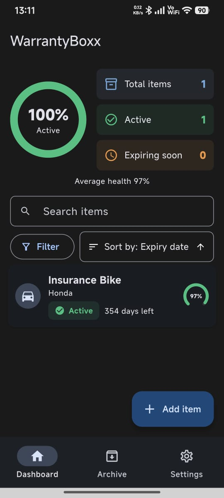
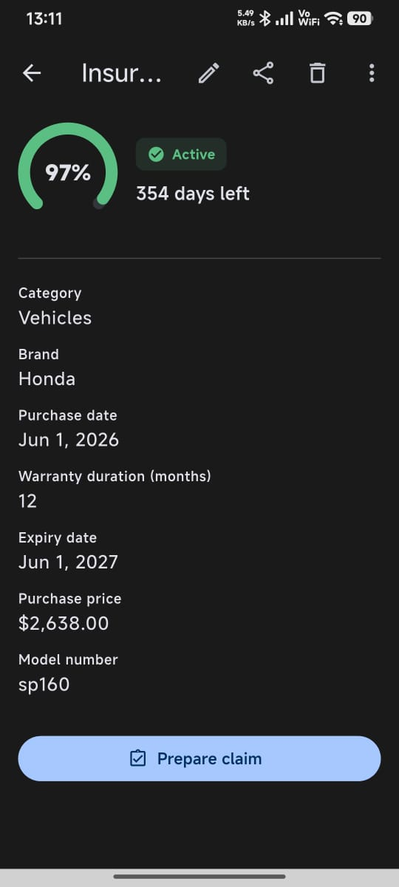
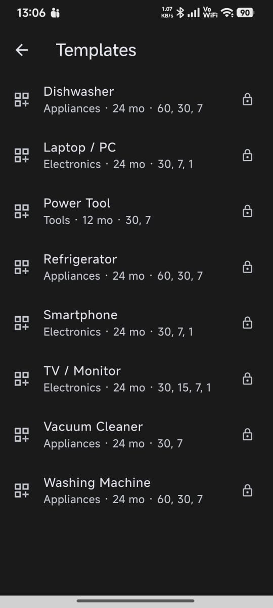
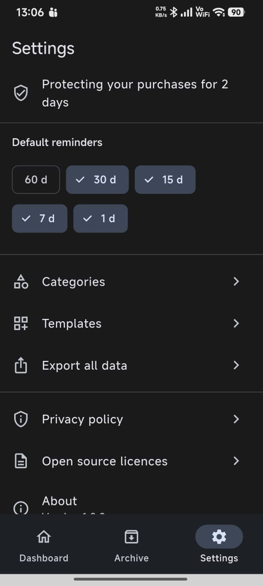
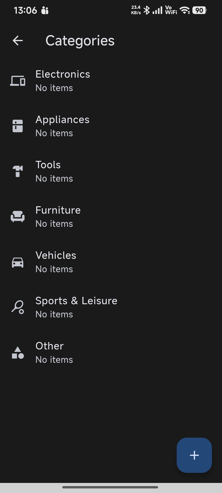
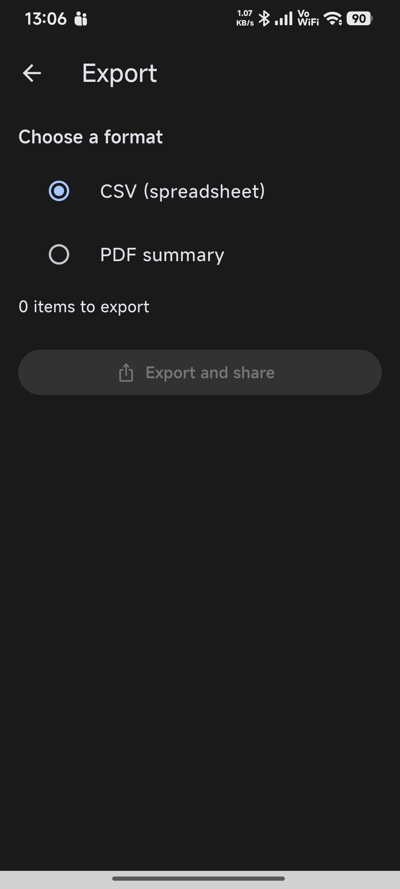
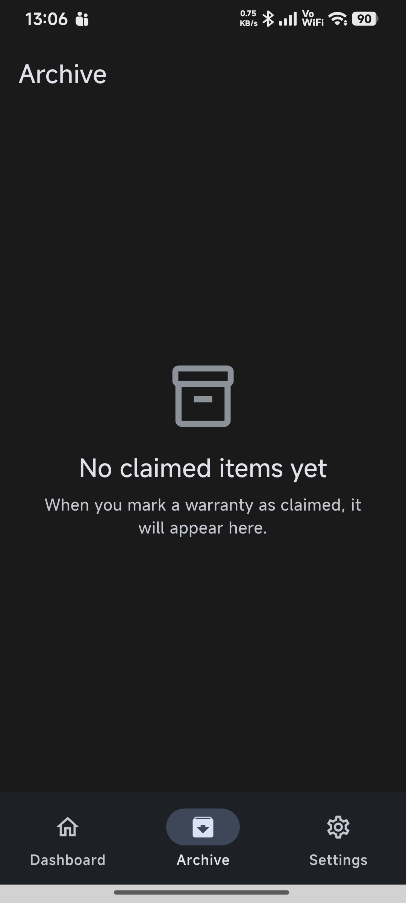
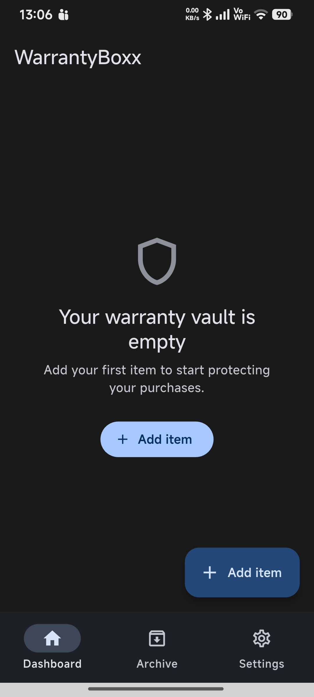

<div align="center">


# WarrantyBoxx

**Every warranty. Always remembered.**

A dedicated, fully offline, open-source warranty tracker for Android.
Add your purchases, get reminded before warranties expire, and prepare
successful claims — all without an account, a server, or a single network call.

[](LICENSE)

</div>

## Overview

Consumers lose money every year by failing to claim repairs and replacements on
products still under warranty. The problem is not awareness — it is friction:
receipts get lost, expiry dates are forgotten, and there is no single place to
track what is covered and for how long. WarrantyBoxx turns the moment of
purchase into a 60-second entry that makes sure you never miss a claim again,
without asking you to create an account or share any data.

## Features

- 📋 **Item vault** — track purchases with brand, category, retailer, price,
  serial and model numbers, notes, and up to five photos of receipts or
  products (photos are compressed and stored locally).
- 🔔 **Local expiry reminders** — get notified 30, 15, 7 and 1 day before a
  warranty expires (customisable per item and globally in Settings). Reminders
  run entirely offline via Android's WorkManager — no Google services, and they
  survive device reboots.
- 🟢 **Dashboard** — a warranty health ring, tappable summary chips
  (total / active / expiring soon), and your items sorted by expiry date with
  clear green/amber/red/grey status colours.
- 🔍 **Search, filter and sort** — by name, brand, retailer, serial number,
  category, status, price or date.
- 🧰 **Claim Assistant** — when a warranty is about to expire, a guided
  checklist helps you gather receipts, serial numbers and manufacturer
  contacts so your claim succeeds.
- 💷 **Lifetime asset tracker** — see the total value of everything you have
  under active warranty.
- 🧩 **Item templates** — common products (laptop, TV, washing machine, and
  more) pre-fill typical warranty periods and reminder schedules; you can add
  your own.
- 🗂️ **Categories** — built-in categories (Electronics, Appliances, Tools,
  Furniture, Vehicles, Sports & Leisure, Other) plus custom ones.
- 📤 **Export and share** — export your whole vault to CSV or a formatted PDF,
  or share a single item as plain text for a claim email, all through the
  standard Android share sheet.
- 🏠 **Home screen widget** — see what is expiring soon at a glance; tapping a
  reminder or the widget deep-links straight into the app.
- 📦 **Archive** — claimed items move to an archive with the resolution
  recorded: a tangible record of the money you have reclaimed.
- ♿ **Accessibility** — status is always shown with both colour and an icon or
  text, photos support alt text, touch targets meet accessibility minimums,
  and the interface scales with your system font size. Light and dark themes
  follow the system setting.
- 🔒 **100% offline** — no accounts, no cloud, no sync, no analytics, no
  trackers, no Google Mobile Services or Firebase. The app simply does not
  talk to the internet.

## Screenshots

| Dashboard | Item detail | Templates | Settings |
|:---:|:---:|:---:|:---:|
|  |  |  |  |

| Categories | Export | Archive | First run |
|:---:|:---:|:---:|:---:|
|  |  |  |  |

## Installation

WarrantyBoxx targets F-Droid as its primary distribution channel. Until it is
published there, you can build the APK yourself (see
[Building](#building-from-source)) or install a release APK from the
[releases page](https://github.com/BloodBlinker/WarrantyBoxx-/releases).

**Supported platform:** Android 8.0 (Oreo, API 26) and above.

## Usage

1. **Add an item** — name, purchase date and warranty duration are all you
   need; the expiry date is calculated automatically. Use a template to
   pre-fill typical values, and optionally attach photos of the receipt,
   serial plate, or product.
2. **Relax** — the dashboard shows the health of every warranty, and local
   notifications remind you before anything expires.
3. **Claim in time** — when an item is close to expiry, open it and tap
   **Prepare claim**. The Claim Assistant walks you through gathering what a
   successful claim needs.
4. **Archive** — once a claim is resolved, record the outcome; the item moves
   to the archive as a record of money reclaimed.
5. **Back up** — export everything to CSV or PDF from Settings whenever you
   like. Your data never leaves the device unless you share it.

## Technology stack

- **[Flutter](https://flutter.dev)** (Dart) — UI framework
- **[Riverpod](https://riverpod.dev)** — state management and dependency injection
- **[Drift](https://drift.simonbinder.eu)** — type-safe, reactive SQLite database
- **[go_router](https://pub.dev/packages/go_router)** — navigation with deep-link support
- **[flutter_local_notifications](https://pub.dev/packages/flutter_local_notifications)** + **[workmanager](https://pub.dev/packages/workmanager)** — offline reminders (no Firebase/GMS)
- **[home_widget](https://pub.dev/packages/home_widget)** — home screen widget
- **[image_picker](https://pub.dev/packages/image_picker)** + **[flutter_image_compress](https://pub.dev/packages/flutter_image_compress)** — photo capture and compression
- **[pdf](https://pub.dev/packages/pdf)**, **[csv](https://pub.dev/packages/csv)**, **[share_plus](https://pub.dev/packages/share_plus)** — export and sharing

## Architecture

Strict feature-first layering (`lib/features/**`) over a data layer
(`lib/data/**` — Drift database, DAOs, repositories, Riverpod providers) and a
pure-Dart domain layer (`lib/domain/**`). Features never touch Drift directly;
all access goes through repositories. Warranty maths lives in pure, fully
tested functions.

```
lib/
  app/         router, theme, app shell, route constants
  features/    one folder per screen/feature
               (dashboard, item_add_edit, item_detail, item_list, archive,
                categories, templates, export, settings)
  data/        Drift database + DAOs, repositories, Riverpod providers
  domain/      models + services (pure Dart, no Flutter)
  shared/      reusable widgets, utils, constants
  l10n/        ARB strings (English at launch, i18n-ready)
```

## Building from source

Requires Flutter 3.44+ (Dart SDK ^3.12.1), JDK 21, and the Android SDK
(minSdk 26 / Android 8.0).

```bash
flutter pub get
dart run build_runner build --delete-conflicting-outputs   # Drift/Riverpod codegen
flutter gen-l10n                                           # localisation
flutter run                                                # debug build
flutter build apk --release                                # release APK
```

## Testing

```bash
flutter analyze                   # zero issues expected
flutter test                      # unit + widget + integration
flutter test --tags performance   # 1000-item dashboard budget
python3 tool/fdroid_verify.py build/app/outputs/flutter-apk/app-release.apk
```

## Permissions

All permissions are requested only at the point of use, and the app is fully
usable if you decline them:

| Permission | Why |
|---|---|
| `CAMERA` | Take photos of receipts/products (requested when you tap "Take photo"; camera hardware is optional) |
| `READ_MEDIA_IMAGES` / `READ_EXTERNAL_STORAGE` (≤ Android 12) | Pick existing photos from the gallery |
| `POST_NOTIFICATIONS` | Warranty expiry reminders (requested after your first item is added) |
| `RECEIVE_BOOT_COMPLETED` | Re-deliver missed reminders after a device reboot |
| `SCHEDULE_EXACT_ALARM` / `USE_EXACT_ALARM` | Deliver reminders on the exact day |
| `WAKE_LOCK`, `VIBRATE` | Background reminder/widget refresh and notification vibration |

There is **no** `INTERNET` permission. The app cannot make network calls.

## Privacy

WarrantyBoxx collects nothing and makes no network calls. See
[the privacy policy](assets/privacy_policy.md). F-Droid compliance is enforced
in CI by [`tool/fdroid_verify.py`](tool/fdroid_verify.py), which fails the
build if any proprietary SDK, tracker domain, or outbound network API is
detected.

## Contributing

Issues and pull requests are welcome. Before submitting a PR, please make sure
`flutter analyze` reports zero issues and `flutter test` passes. New
dependencies need explicit justification — the project deliberately keeps its
dependency list small and F-Droid-compatible (no proprietary SDKs, no network
libraries).

## Support the Project 🎓

WarrantyBoxx is free and always will be. I'm a developer from Kerala, India. I
built this app because I needed it and it didn't exist. Every contribution I
receive goes into a savings fund — I'm working toward my Master's degree,
collecting money one step at a time.

If this app helped you out, even a small amount means a lot.

**UPI ID:** `robinwackerman@okaxis`

For international supporters — feel free to reach out via GitHub Issues and
I'll sort something out.

## Licence

GPL-3.0-only. See [LICENSE](LICENSE) and [NOTICE](NOTICE).
